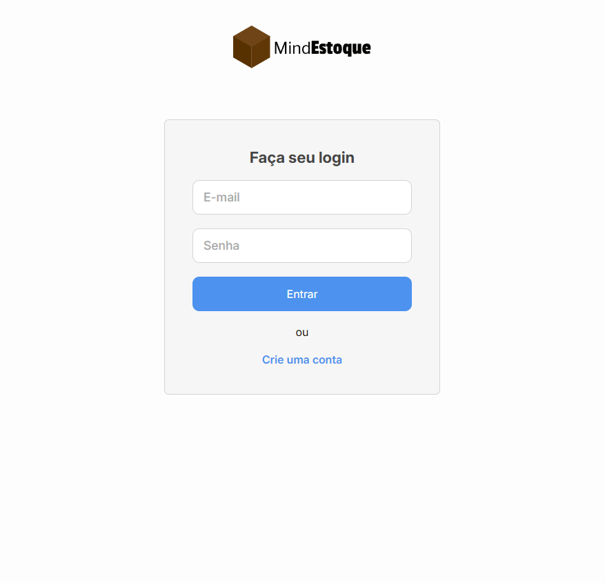
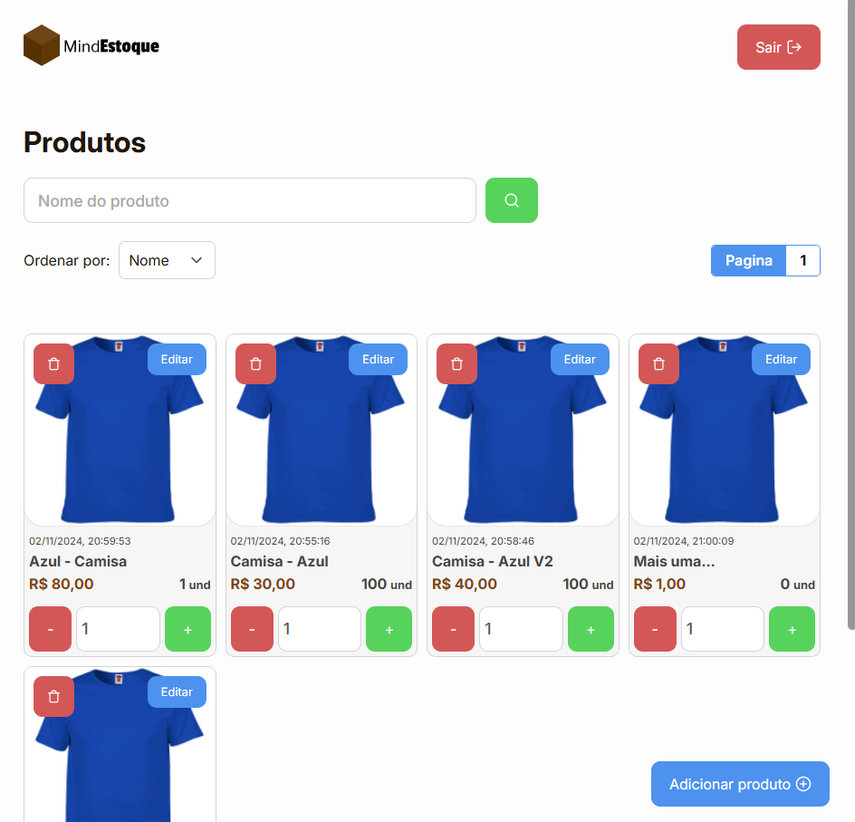

<div>
  <div align="center">
    
  </div>

  <h2>Case Estágio Mind Group - Frontend para sistema de estoque</h2>
</div>

**Desafio:** Criar frontend utilizando ReactJS ou React Native com NextJS, ViteJS ou Expo. Frontend deve consumir o backend para registrar, visualizar, editar, remover produtos e autenticar usuários.

[Link para o repositório Backend](https://github.com/VDRBreno/MindGroup-TesteEstagio-Estoque-Backend)

<br/>

## Pré visualização




<br/>

## Instalação ( Yarn )

```bash
git clone https://github.com/VDRBreno/MindGroup-TesteEstagio-Estoque-Frontend.git

cd MindGroup-TesteEstagio-Estoque-Frontend

# Instalar as dependências
yarn

# Iniciar aplicação
yarn dev

# Aplicação rodando em localhost:5173
```

<br/>

## Tecnologias usadas

- TypeScript
- React
- Sass
- Context API